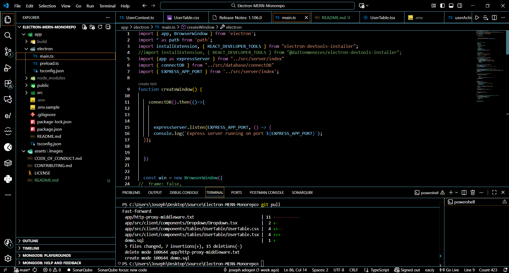
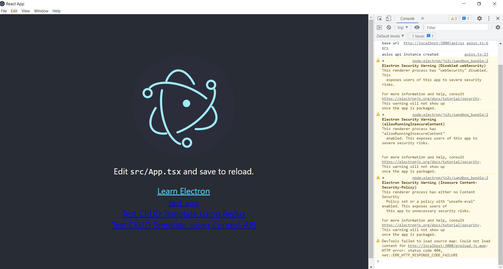
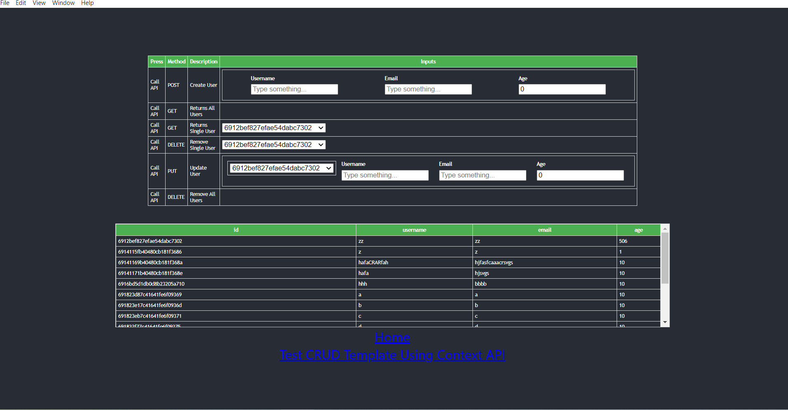
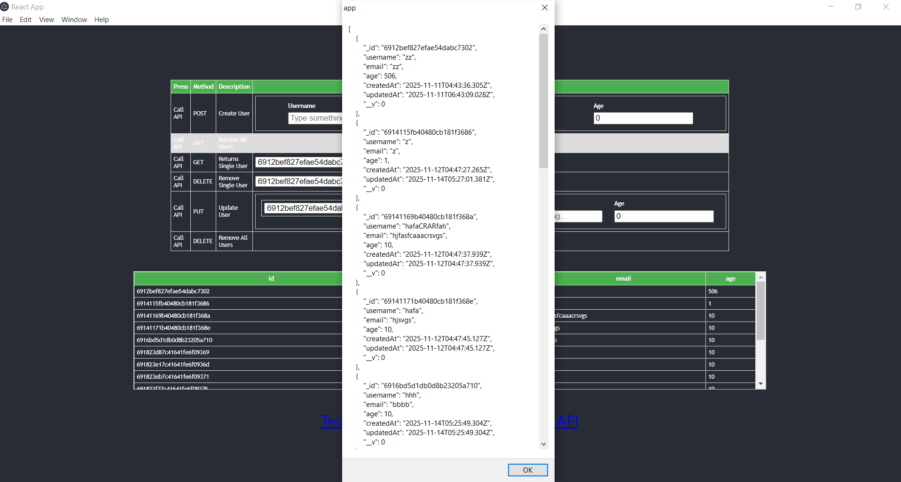
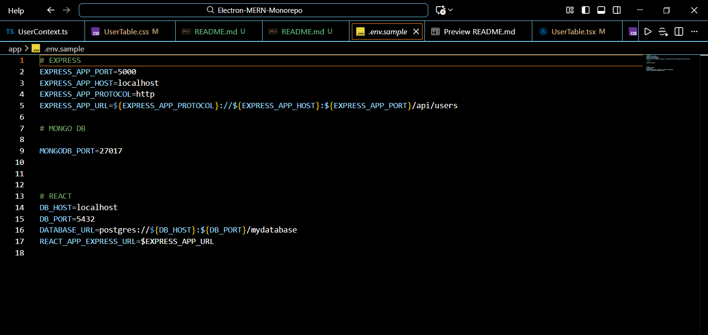
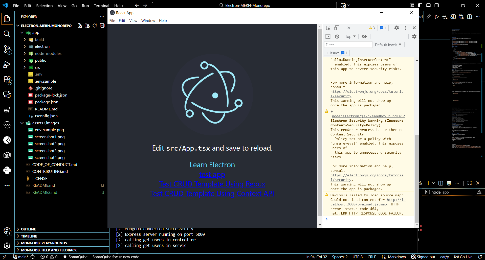
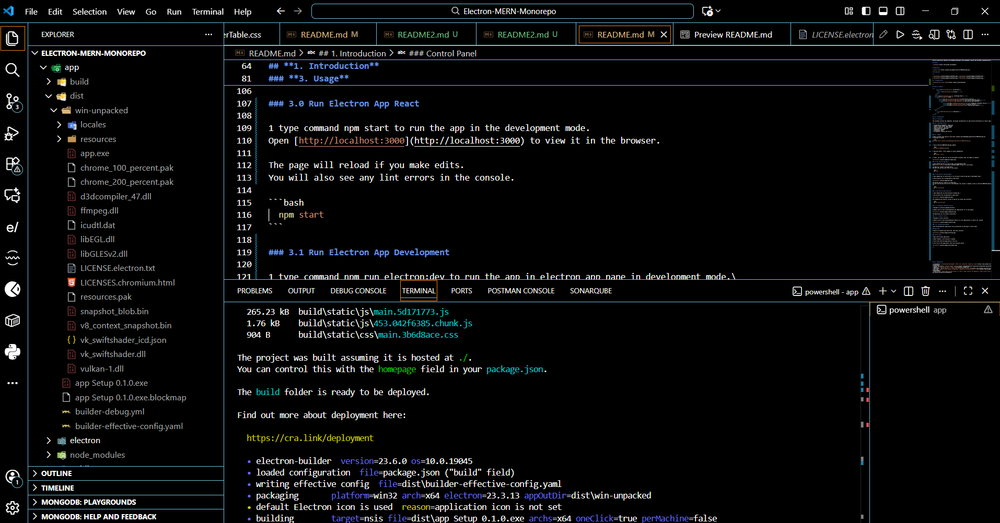
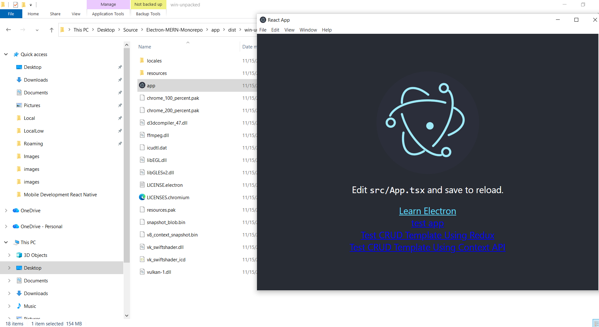
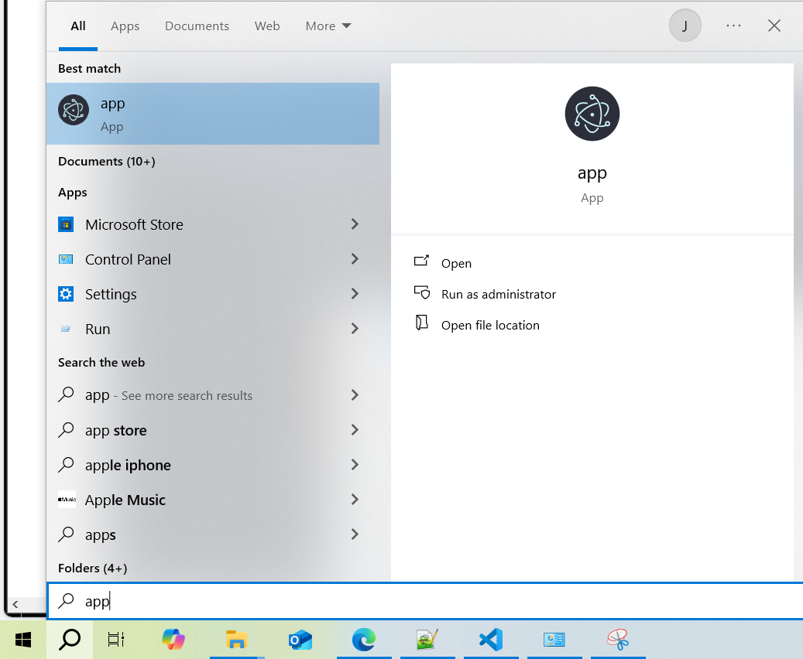
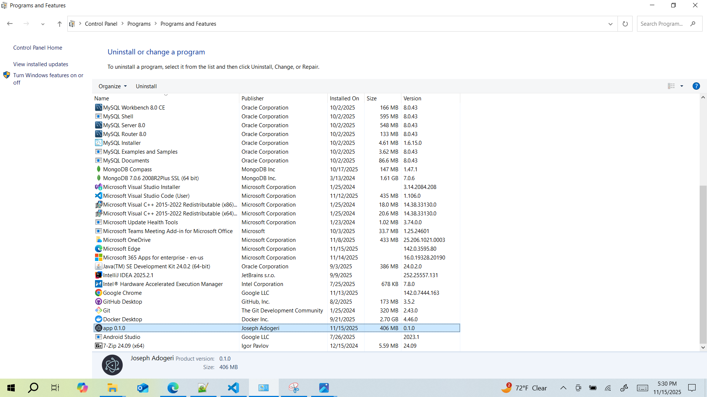

## **Electron MERN Monorepo**

**Version:** 1.0
**Date:** November 15, 2025

---

## Description

Electron application template with embedded datbaseand state management (Context API and Redux implementations)) in typescript.

## Authors

- [@jadogeri](https://www.github.com/jadogeri)


## Repository

- [source code ](https://github.com/jadogeri/Electron-MERN-Monorepo.git)

## Screenshots

---

|  |  |
| -------------------------------------------- | -------------------------------------------- |
|  |  |

## . Prerequisites**

* [Download and install NodeJS](https://nodejs.org/en/download)

---

## Table of Contents

<ul>
      <li><a href="#1-introduction">1. Introduction</a>
        <ul>
          <li><a href="#11-purpose">1.1 Purpose</a> </li>
        </ul>
      </li>
    </ul>
    <li><a href="#2-technology-stack">2. Technology Stack</a> </li>
    <li><a href="#3-usage">3. Usage</a> 
        <ul>
            <li><a href="#30-run-electron-app-react">3.0 Run Electron App React</a> </li>
            <li><a href="#31-run-electron-app-development">3.1 Run Electron App Development</a> </li>
            <li><a href="#32-run-electron-app-production">3.2 Run Electron App Production</a> 
                <ul> 
                    <li><a href="#321-standalone-portable-version">3.2.1 Standalone (Portable) Version</a></li>
                    <li><a href="#322-installer-version">3.2.2  Installer Version</a></li>
                    <li><a href="#323-uninstalling-program">3.2.3  Uninstalling Program</a></li>
                </ul>
            </li>
        </ul>
    </li>  
    <ul> 
        <li><a href="#10-references">4. References</a>
        </li>
    <ul>
</ul>

## **1. Introduction**

### **1.1 Purpose**

This document outlines the components, and design considerations for add printing functionality to reactjs application.

### **2. Technology Stack**

- **Programming Languages**: Typescript
- **IDE**: Visual Studio Code (VSCode)
- **Source Control**: Git and GitHub
- **Code Analysis**: SonarQube
- **Database**: MongoDB
- **Frontend**: React
- **framework**: Node, Express and Electron


### **3. Usage**

0 Open a terminal then type git clone https://github.com/jadogeri/Electron-MERN-Monorepo.git
to download to project.

```bash
git clone https://github.com/jadogeri/Electron-MERN-Monorepo.git

```

1 Type cd Electron-MERN-Monorepo/app command.

```bash
  cd Electron-MERN-Monorepo/app
```

2 Type npm install --force command to install dependencies.

```bash
  npm install --force
```

3 Create .env file then fill out the environment variables using .env.sample as template



### 3.0 Run Electron App React

1 type command npm start to run the app in the development mode.
Open [http://localhost:3000](http://localhost:3000) to view it in the browser.

The page will reload if you make edits.
You will also see any lint errors in the console.

```bash
  npm start
```

### 3.1 Run Electron App Development

1 type command npm run electron:dev to run the app in electron app pane in development mode.

a build directory will be generated as shown below.



The desktop app will reload if you make edits.
You will also see any lint errors in the developer tool console if enabled in main.ts (Electron-MERN-Monorepo/app/electron/main.ts).

```bash
  npm run electron:dev
```

### 3.2 Run Electron App Production

1 type command npm run electron:build to bundle app .

a dist directory will be generated as shown below.



The standalone and installer version of app will be inside /dist directory.

```bash
  npm run electron:build
```

### 3.2.1 Standalone (Portable) Version

1 Navigate to /dist/win-unpacked directory.

2 Double click on app.exe (Application) to run the program.



The application can run without installation.

### 3.2.2  Installer version

1 Navigate to /dist/ directory.

2 Double click on app Setup 0.1.0 .exe (Application) to install the  program.


### 3.2.3  Uninstalling program

Electron-MERN-Monorepo application can be uninstalled via searching or control panel

### Searching

1 Search for program using search box, then press uninstall.



### Control Panel

1 Open control panel application.

2 Under Programs, click uninstall a program.

3 Scroll and locate the application in the list.

4 Left click on the application, then click uninstall button.



---

## **4. References**

* FreeCodeCamp : [Frontend Web Development: (HTML, CSS, JavaScript, TypeScript, React)](https://www.youtube.com/watch?v=MsnQ5uepIa).
* AweSome Open Source : [Awesome Readme Templates](https://awesomeopensource.com/project/elangosundar/awesome-README-templates)
* Readme.so : [The easiest way to create a README](https://readme.so/)
* HUXN Webdev : [Master ReactJS in 7 Hours with 10 Real-World Projects 2023](https://www.youtube.com/watch?v=XrwsMN2IWnE/)
* Dave Gray : [React JS Full Course for Beginners | Complete All-in-One Tutorial | 9 Hours](https://www.youtube.com/watch?v=RVFAyFWO4go/)
* Dipesh Malvia : [Learn React JS with Project in 2 Hours | React Tutorial for Beginners | React Project Crash Course](https://www.youtube.com/watch?v=0riHps91AzE/)
